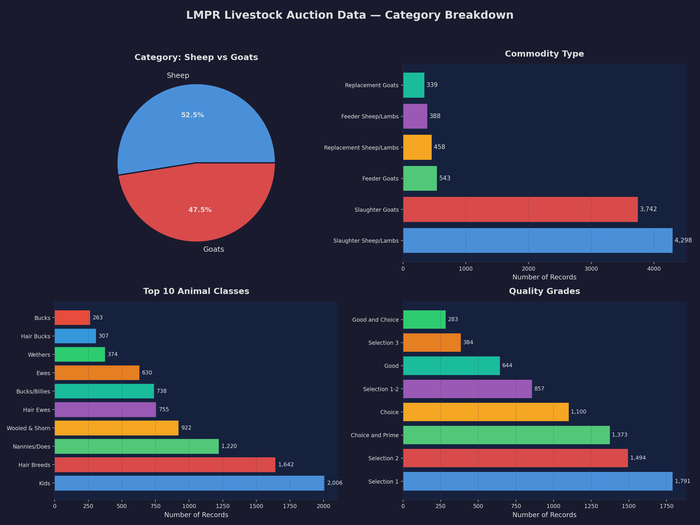
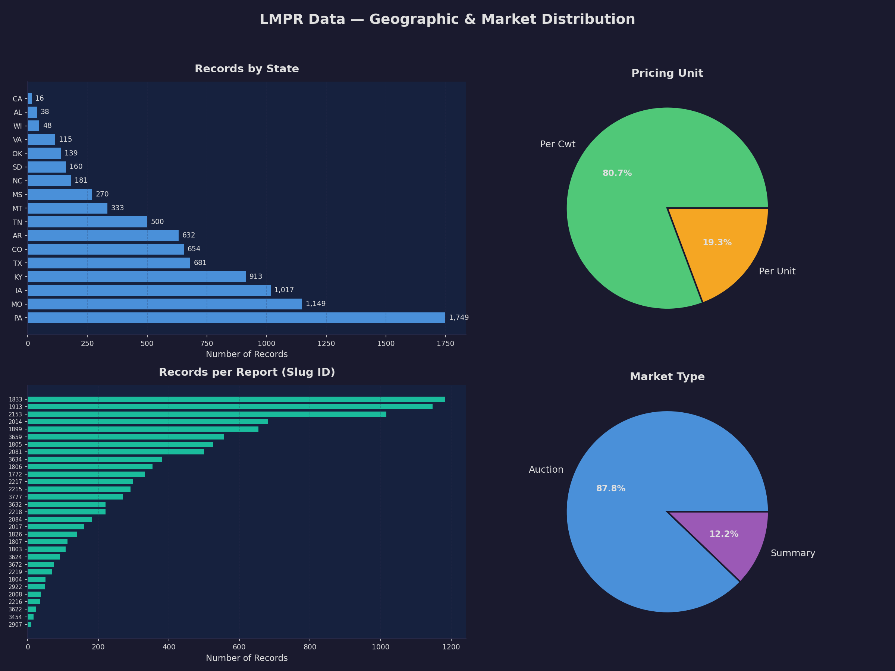
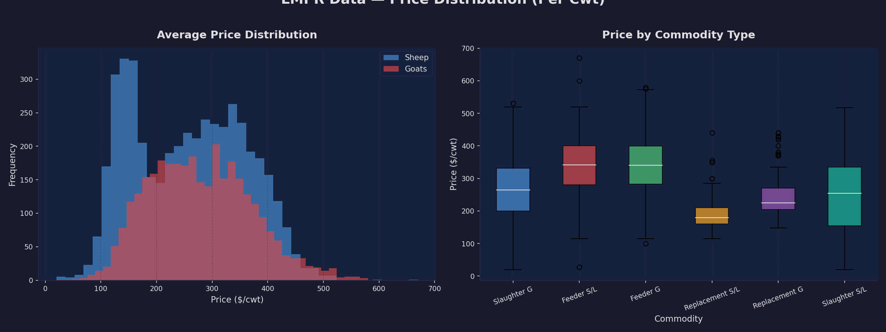

# LMPR Data Analysis

## Data Overview

- **9,789 rows** across **31 CSV files** from **29 auction markets** in **17 states**
- Date range: past 100 days

## Category & Commodity Breakdown

- **Sheep (52%)** vs **Goats (47%)** — nearly even split
- **Slaughter** dominates (82% of records); Feeder and Replacement are niche
- Top classes: Kids, Hair Breeds, Nannies/Does, Wooled & Shorn
- Quality grades: Selection 1–3 most common, then Choice/Good

## Geographic & Market Distribution

- **PA, MO, IA, KY** lead in volume
- 87% individual **Auction** reports, 13% **Summary** (weekly rollups)
- Pricing: 80% **Per Cwt** (per 100 lbs), 20% **Per Unit** (per head)

## Price Distribution

- Goat prices tend higher and more spread than Sheep
- Replacement animals command highest median prices
- Slaughter animals cluster in the $100–$300/cwt range

## Key Column Definitions

| Column                 | Meaning                                                                                         |
| ---------------------- | ----------------------------------------------------------------------------------------------- |
| `category`             | Top-level: **Sheep** or **Goats**                                                               |
| `commodity`            | Purpose: **Slaughter**, **Feeder** (for feeding/fattening), or **Replacement** (breeding stock) |
| `class`                | Animal type: Kids, Ewes, Bucks, Hair Breeds, Wooled, etc.                                       |
| `quality_grade_name`   | USDA grade: Selection 1 (best) → Cull (lowest)                                                  |
| `lot_desc`             | Special descriptors: Pygmies, Yearlings, Fancy, Dairy Goats                                     |
| `price_unit`           | **Per Cwt** = per 100 lbs; **Per Unit** = per head                                              |
| `avg_price`            | Average sale price for the lot                                                                  |
| `head_count`           | Number of animals in the lot                                                                    |
| `receipts`             | Total animals at this auction session                                                           |
| `market_type_category` | **Auction** = individual sale; **Summary** = weekly state rollup                                |
| `report_narrative`     | Full market commentary from the USDA reporter                                                   |

## Scripts

- `get_lmpr_data.py` — Fetches past 100 days of LMPR data from USDA MARS API
- `visualize_lmpr.py` — Generates the charts above
